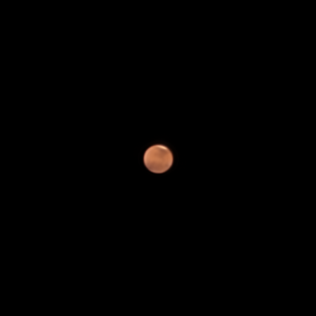

---
author:
categories:
date: "2024-11-01"
draft: false
excerpt: Featuring one polar ice cap.
subtitle: 
title: Mars
---

Jan 17th, 2025





Orion XT10 \
[Optolong UV/IR Cut Filter](https://agenaastro.com/optolong-1-25-uv-ir-cut-filter.html) \
[Astronomania 3x Barlow](https://www.amazon.com/dp/B0140UAEBA?ref_=ppx_hzsearch_conn_dt_b_fed_asin_title_2), [extension tube](https://www.amazon.com/dp/B0140U9URO?ref_=ppx_hzsearch_conn_dt_b_fed_asin_title_3&th=1) and [T-Ring Adapter](https://www.amazon.com/dp/B0140U9KLK?ref_=ppx_hzsearch_conn_dt_b_fed_asin_title_3&th=1) \
Canon T3i \
\
Taken from San Diego, CA.


