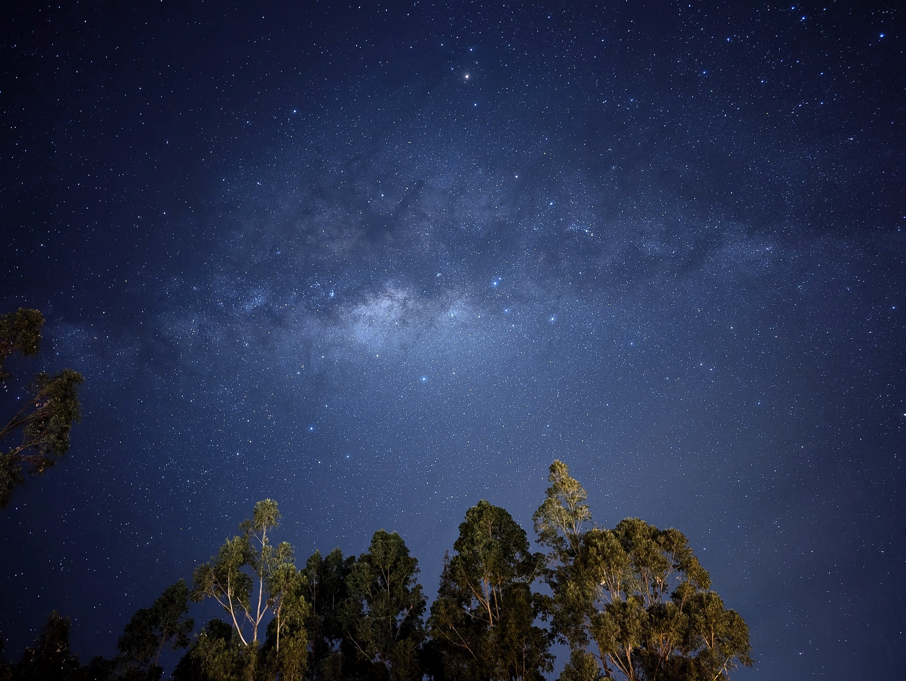
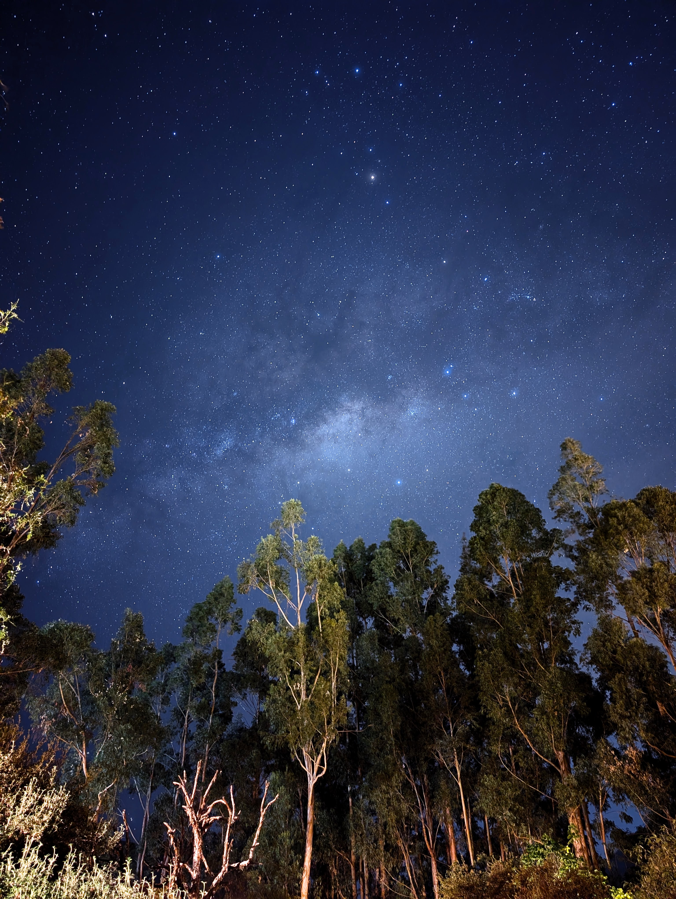
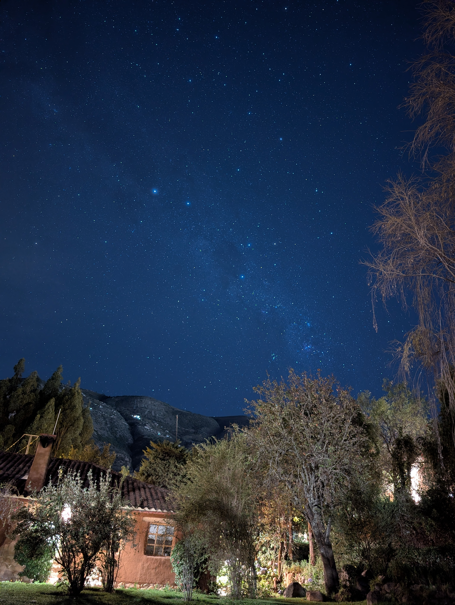

---
author:
categories:
date: "2023-09-01"
draft: false
excerpt: Macro
subtitle: 
title: Milky Way
---

May 25th, 2025





Pixel 8 Astrophotography Automated Stacking Feature \
Pixel 8 Astro Imagery Filter



The above photo is a compilation of images taken across four minutes on a clear night in Urubamba, Peru. \
\






Pixel 8 Astrophotography Automated Stacking Feature \
Pixel 8 Astro Imagery Filter



The brightest star in this photo, midway up on the left side, is Alpha Centauri. This is the closest star system to us and the third brightest star (even though it's actually a system of three) in the sky after Sirius and Canopus. In this photo it's just upstream, to the left, of the Southern Cross. This was a treat to see as it can't be seen in the Northern Hemisphere at all. 






Pixel 8 Astrophotography Automated Stacking Feature

