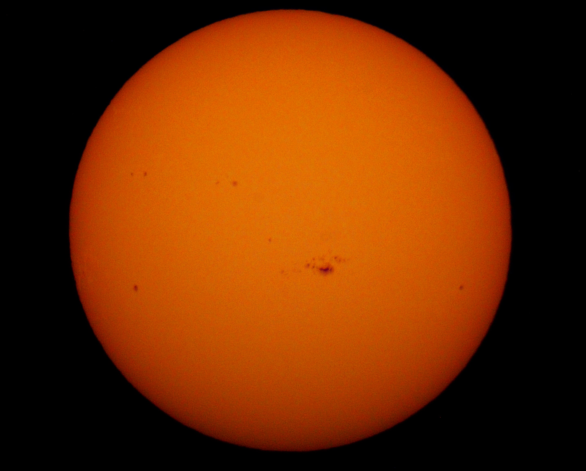

---
author:
categories:
date: "2024-02-10"
draft: false
excerpt: The Sun.
subtitle: 
title: Sol
---

February 10th, 2024





Canon T3i with [Baader Solar Film](https://agenaastro.com/baader-astro-solar-spotter-filter-assf-65.html) \
ISO at 200 \
Shutter Speed at 1/1250 seconds



This photo was taken in white light and then edited to reflect the more orange-yellow we would expect from the sun. \
The dark spots are called sunspots and are cool areas on the Sun's surface that are magnetically charged. For scale the largest sunspot in this photo is about the size of Earth. \
\
Learn more about [the Sun](https://science.nasa.gov/sun/facts/).