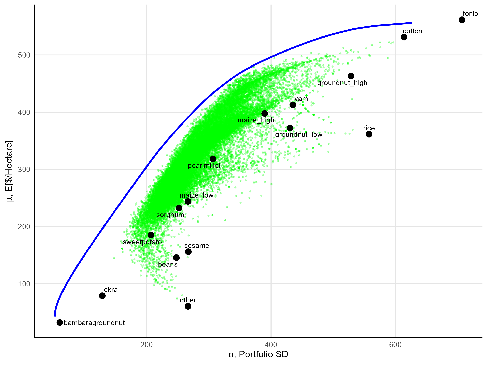

---
author:
categories: [workinprogress]
date: "2026-04-27"
draft: false
excerpt: In progress, current draft available on request.
layout: single
links:
- icon: envelope
  icon_pack: fas
  name: Draft available upon request
  url: "mailto:varmenta@ucsd.edu"
subtitle: "Job market paper."
title: "Crop Portfolio Diversification under Fixed Entry Costs: Evidence from a Cash Transfer in Mali"
---
 
### Abstract
 
The selection of crops farmers cultivate has long been recognized as a portfolio problem, but the literature currently measures the properties of a farmer’s portfolio with crop counts and Herfindahl variants that cannot capture the variance-covariance structure determining welfare-relevant risk. I apply Modern Portfolio Theory (MPT) to smallholder agriculture, constructing a covariance matrix of crop returns from a Malian panel and evaluating household portfolios relative to efficient frontiers. Three findings emerge. First, smallholders exhibit a positive size-diversification gradient where doubling cultivated area is associated with adding one crop type, consistent with a per-crop fixed cost. Second, exogenous cash grants relax the implied constraint through the extensive margin. The treated group expands cultivation by 15.5% of the control mean for crops at small baseline shares, with little movement on high-share crops, and the smallest-farm quintile fails to clear the threshold even with the grant. Third, the resulting reallocation reduces the standard deviation on portfolio returns per hectare while leaving expected profit per hectare unchanged, raising the Sharpe ratio and moving households closer to their community-specific efficient frontiers. An exercise making reasonable assumptions about risk aversion yields certainty-equivalent welfare gains of 17–27% of grant value from this movement in portfolio properties. With 59% of idiosyncratic income shocks passing through to consumption in this setting, liquidity-constrained households bear inefficiently high portfolio variance because the additional crops that would reduce risk lie behind a fixed-cost threshold they cannot clear — a hidden production cost of incomplete markets that crop counts and HHI miss, but the MPT framework recovers.

