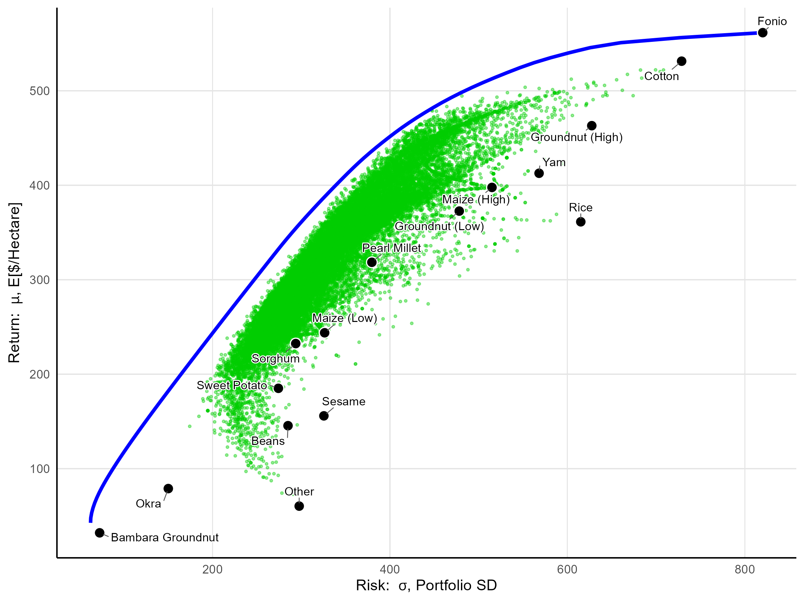

---
author:
categories: [workinprogress]
date: "2026-04-27"
draft: false
excerpt: In progress, current draft available on request.
layout: single
links:
- icon: envelope
  icon_pack: fas
  name: Draft available upon request
  url: "mailto:varmenta@ucsd.edu"
subtitle: "Job market paper."
title: "Measuring Risk from Crop Portfolio Choices in Development Interventions"
---
 
### Abstract
 
Development policy has promoted crop diversification for decades as a way to reduce smallholder farmers’ exposure to risk. In spite of this, the standard measures of diversification, crop counts and concentration indices, cannot sign changes in portfolio risk. I make the long-standing analogy between crop choice and
financial portfolio choice exact, estimating expected returns and the full covariance matrix of crop returns from plot-crop-level panel data in Southern Mali. Theory leaves the risk response to a cash transfer ambiguous: it could buy higher returns or lower risk. Farmers randomly assigned an unconditional cash transfer reduced portfolio risk without a detectable change in expected returns, an efficiency gain worth 5.5 to 16 percent of the transfer value. Count-based measures miss this reduction entirely, registering only that treated farmers grow more unique crop types. The poorest recipients reallocate land across crops without expanding portfolio size while the richest expand it, consistent with a fixed cost of entering a new crop. This evidence points to a liquidity constraint on diversification rather than a shift in apparent preferences for risk, and counting unique crops turns out to be neither necessary nor sufficient to sign a change in portfolio risk.

