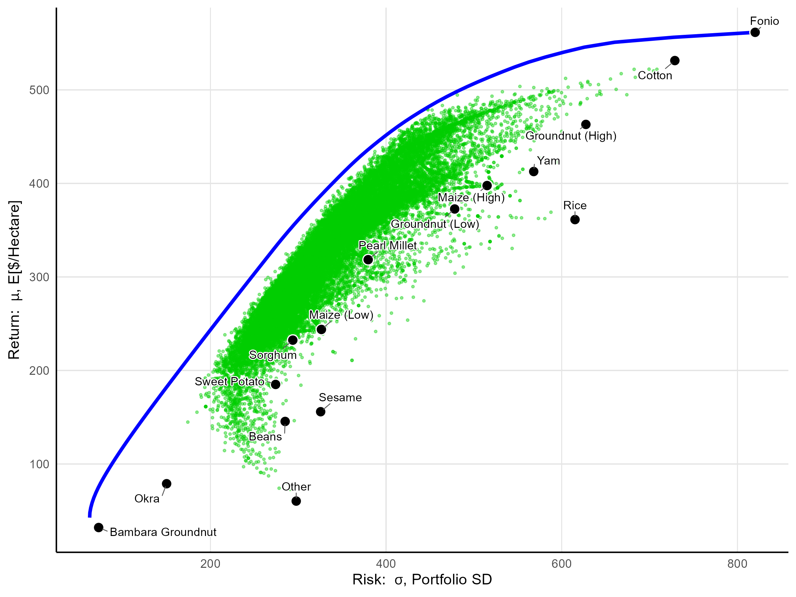

---
author:
categories: [workinprogress]
date: "2026-09-28"
draft: false
excerpt: Job market paper. [Current draft](https://vincentarmentano.com/research/cropdiv/armentanov_cropdiv.pdf).
layout: single
links:
- icon: file-pdf
  icon_pack: fas
  name: Current draft (October 2026)
  url: https://vincentarmentano.com/research/cropdiv/armentanov_cropdiv.pdf
- icon: envelope
  icon_pack: fas
  name: Comments welcome
  url: "mailto:varmenta@ucsd.edu"
subtitle: "Job market paper."
title: "Measuring Risk from Crop Portfolio Choices in Development Interventions"
---
 

### Abstract
 
Development policy has promoted crop diversification for decades as a way to reduce smallholder farmers’ exposure to risk. In spite of this, the standard measures of diversification, crop counts and concentration indices, cannot sign changes in portfolio risk. I make the long-standing analogy between crop choice and financial portfolio choice exact, estimating expected returns and the full covariance matrix of crop returns from plot-crop-level panel data collected for a cash transfer experiment in Southern Mali. Theory leaves the risk response to that transfer ambiguous: it could buy higher returns or lower risk. Farmers randomly assigned the grant reduced portfolio risk but did not sacrifice expected returns. Bounding risk aversion from where farmers sit relative to the efficient frontier, I value this gain at 5.2 to 12 percent of the transfer value per season. Standard count-based and specialization measures show significant effects but miss this improvement in efficiency entirely. The richest households in the sample reduce risk by expanding their portfolio breadth, consistent with a fixed cost of entering a new crop. In contrast, the poorest recipients do not expand their portfolios but still reduce risk through reallocating land across crop types. This evidence points to a liquidity constraint on diversification rather than a shift in preferences for risk.

<!--figure-->



--- 
### Presentations
[North East Universities Development Consortium (NEUDC)](https://cidercornell.github.io/neudc2026), Cornell University, November 2026 \
[CEGA Research Retreat (R²)](https://cega.berkeley.edu/event/cega-research-retreat-r2-2026/), UC Berkeley, October 2026 \
[Development and Political Economics Conference](https://events.stanford.edu/event/devpec-2026), Stanford King Center on Global Development, April 2026
